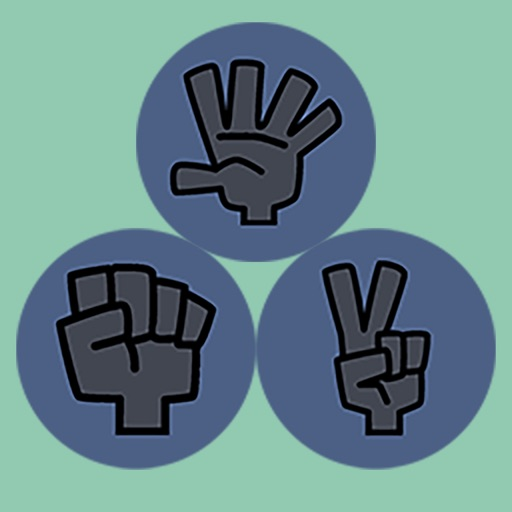
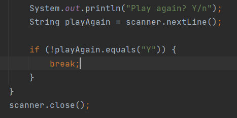

# Rock Paper Scissors Game
A game played between a person and a computer  
in which a computer and a person randomly select one  
of the three figures(rock, paper or scissors). 

Possible outcomes: a draw, computer's victory and user's loss  
or user's victory and computer's loss.

## Possible cases:

* if (player == rock) and (computer == paper); computer wins

* if (player == paper) and (computer == paper); draw

* if (player == scissors) and (computer == paper); player wins

* if (player == rock) and (computer == rock); draw

* if (player == paper) and (computer == rock); player wins

* if (player == scissors) and (computer == rock); computer wins

* if (player == rock) and (computer == scissors); player wins

* if (player == paper) and (computer == scissors); computer wins

* if (player == scissors) and (computer == scissors); draw

## Algorithm
1. Computer selects a random option out of 3 options: rock, paper or scissors.  
A user makes his choice too. 
2. Both choices get displayed.
3. The result of the round gets displayed. 
4. The program asks the user if he wants to continue playing.
5. If yes - algorithm.1 repeats, if no the game ends.  

>

